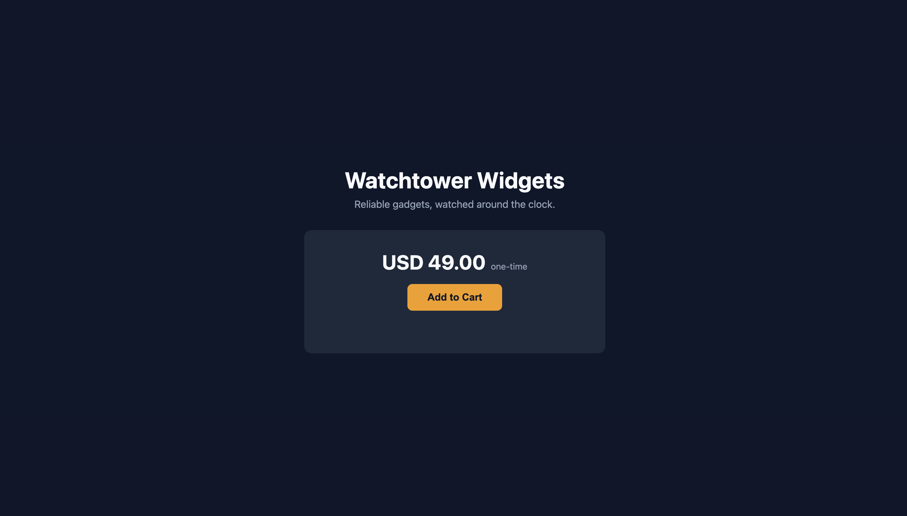
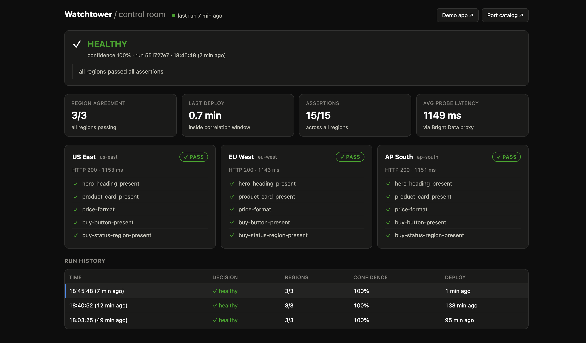
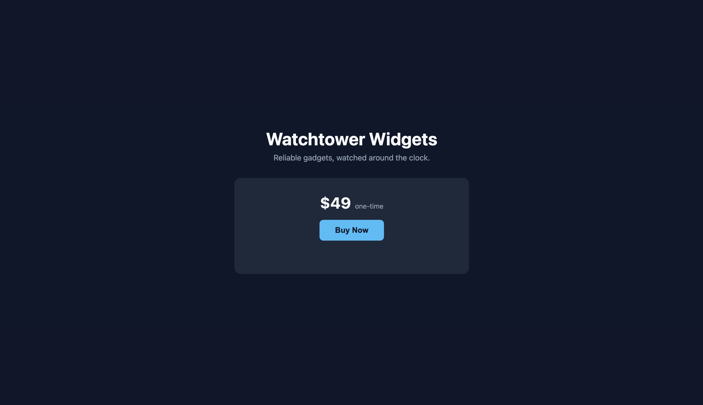
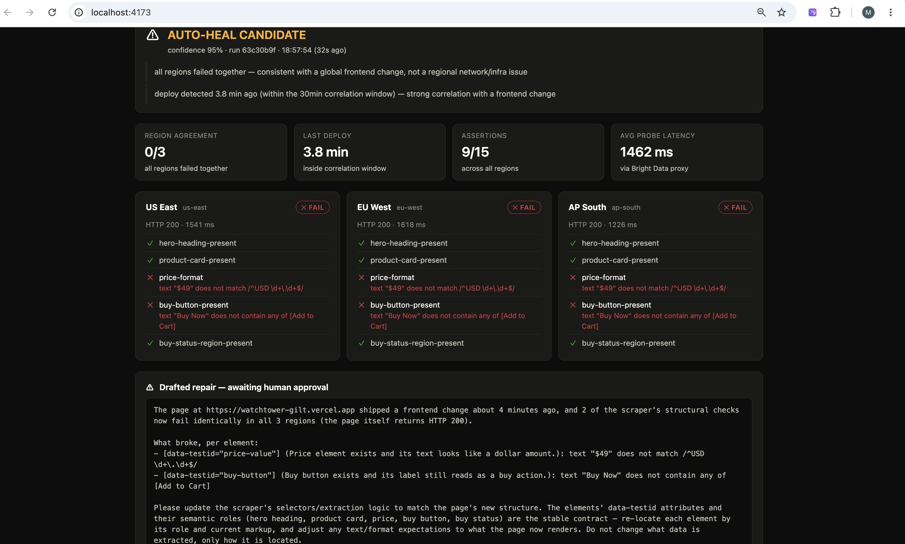
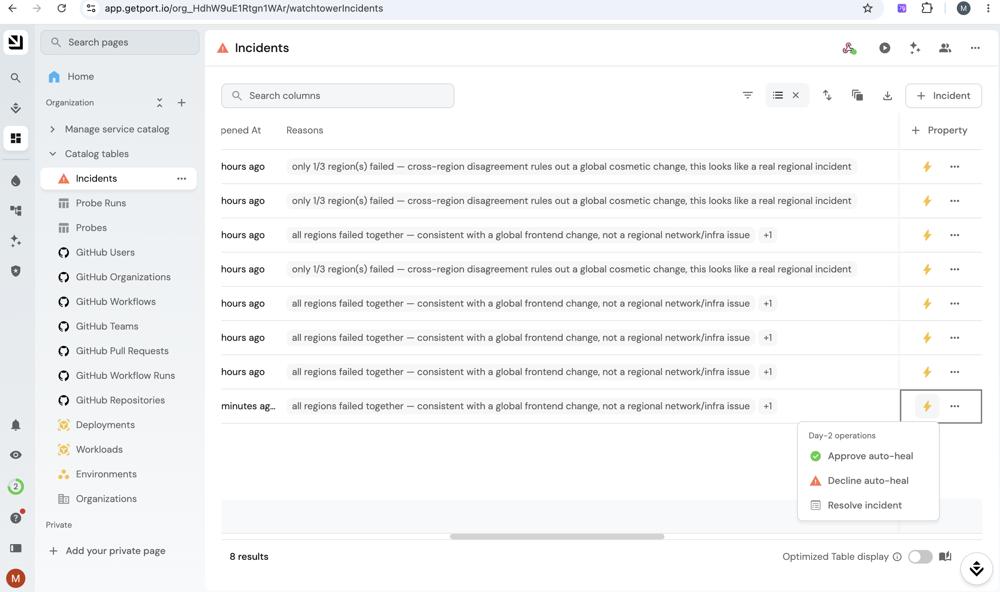
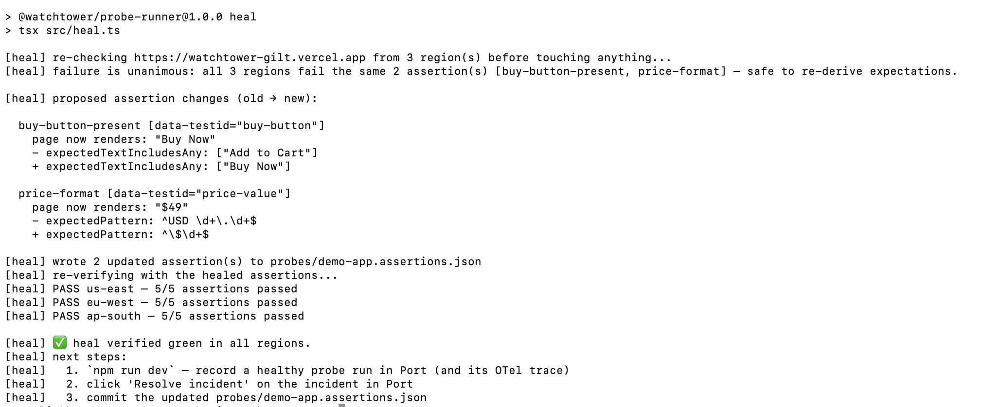
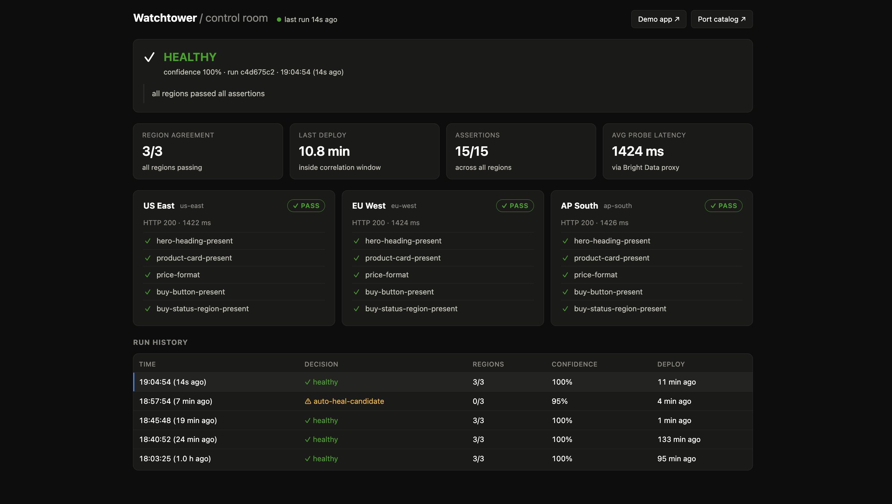

# Watchtower — screenshot walkthrough

A step-by-step tour of the two demo scenarios, run live against the deployed app, Bright Data's proxy network, and Port. Same symptom in both scenarios — failed assertions — two opposite, correct responses. That triage is the deliverable.

## The target

The demo app, live on Vercel at `https://watchtower-gilt.vercel.app`. Deliberately tiny — a hero heading, a product card with a price, a buy button — just enough surface to assert against and to visibly change on purpose. Every element carries a stable `data-testid`, so probes survive pure CSS/class renames; only *meaningful* changes (copy, price format, structure) can break an assertion.

This is the state the monitor currently trusts: `probes/demo-app.assertions.json` expects the button to say "Add to Cart" and the price to match `^USD \d+\.\d+$`. Three probe regions fetch this page through Bright Data's proxy and check those expectations on every run.

## The healthy baseline

The control room (`npm run ui`, local and read-only) after a probe run against that page:

Everything the decision will later be made *from* is already visible here:

- **Decision banner** — `HEALTHY`, 100% confidence, with the reason in plain words.
- **Signal tiles** — the exact inputs to the triage: region agreement (3/3), minutes since last deploy vs. the correlation window, assertion totals, probe latency through Bright Data.
- **Region cards** — per-region HTTP status, latency, and all five assertions individually (this is where a failure will show its reason).
- **Run history** — click any row to replay a past run's full picture.

The page is deliberately read-only: approvals happen in Port, and the runner's environment holds no Port API credentials — the dashboard only observes.

---

# Scenario 1 — the frontend changes, the app is fine

## A redesign ships

Marketing wants new copy and a new look. The button becomes **"Buy Now"**, the price is restyled to **"$49"**, and the accent color goes sky-blue. Deployed with `npm run deploy`, which also records the deploy timestamp — that timestamp becomes a triage signal in a moment.

The app is perfectly healthy — a user can browse and buy. But the monitor still expects "Add to Cart" and `^USD \d+\.\d+$`. Its expectations just went stale, and the next probe run can't tell that apart from an outage… by looking at one region alone.

## The probe run fails — and the triage runs

The next `npm run dev` after the redesign:

Every assertion that could break, broke — but look at *how* it broke, because that's the whole system in one screen:

- **All three regions fail identically**: the same two assertions (`price-format`, `buy-button-present`) with the same reasons — "$49" doesn't match the expected price pattern, "Buy Now" isn't "Add to Cart" — while HTTP stays 200 everywhere and the other three assertions pass. Regions don't break identically by coincidence.
- **A deploy landed 3.8 minutes ago**, inside the 30-minute correlation window.
- Cross-region agreement on the failure alone is worth 0.6 confidence; the correlated deploy pushes it to **0.95** — over the 0.9 threshold, so the verdict is **AUTO-HEAL CANDIDATE**, with both reasons spelled out in the banner. This is a scoring function you can read, not a black box.
- Bottom panel: the system has **drafted a repair** — a natural-language description of what broke per element, shaped for a self-heal flow — but it is explicitly *awaiting human approval*. Nothing has been changed. An incident with this drafted repair has been opened in Port, where a human decides.

## The human gate — Approve in Port

The incident catalog in Port, with the day-2 operations menu open on the fresh incident:

Two things worth noticing:

- **The Reasons column is the audit trail.** Every incident carries the triage verdict in plain language — earlier rows read *"only 1/3 regions failed — cross-region disagreement rules out a global cosmetic change, this looks like a real regional incident"*, while this one reads *"all regions failed together — consistent with a global frontend change."* Anyone can reconstruct why the system decided what it decided, per incident, forever.
- **The decision belongs to a person.** Three self-service actions — **Approve auto-heal**, **Decline auto-heal**, **Resolve incident** — and until someone clicks Approve, the drafted repair is inert. Port holds no credentials to call back into the runner and the runner changes nothing on its own; clicking Approve authorizes the operator to run the healer.

We click **Approve auto-heal**.

## The heal — automated repair, verified

With approval given, the operator runs `npm run heal`:

Reading top to bottom, this is the whole repair contract:

- **It doesn't trust the minutes-old incident.** First line: re-fetch the live page from all three regions *right now* and re-check. The gates must pass at heal time — the failure is unanimous, and every region fails the same two assertions. Had even one region disagreed, this run would have aborted with no changes: that pattern belongs to a real incident.
- **New expectations come from the page's own reality.** For each broken assertion it reads what the element renders now: the button says "Buy Now" — that becomes the expectation; the price "$49" is generalized into the pattern `^\$\d+$`, so the next price change won't re-break the monitor. (This step also hard-aborts if the current text smells like a shipped bug — `undefined`, `[object Object]`, unrendered templates — refusing to codify a bug into the monitor.)
- **The change is a readable diff**, old → new, two lines per assertion — the same review-the-diff shape as Bright Data's self-heal flow. It heals the artifact that actually went stale: `probes/demo-app.assertions.json`, the monitor's expectations. Application code is never touched.
- **It proves itself before finishing**: fresh fetch with the healed assertions — 5/5 in all three regions — then hands back the closing steps: record a healthy run, resolve the incident in Port, commit the healed file so git keeps the history of how the monitor's expectations evolved.

## Green again — the loop closes

The follow-up `npm run dev` records the recovery:

Back to **HEALTHY**, 15/15 across all regions — but now against the *new* expectations: "Buy Now" and the `$49` price format are what the monitor trusts going forward. The run history tells scenario 1 in three rows: healthy → auto-heal-candidate (0/3 regions, 95%) → healthy. A redesign shipped, the monitor went stale, the system diagnosed it, a human approved, the monitor repaired itself, and recovery was verified — with the incident's **Resolve** click in Port closing the audit trail. Total human involvement: reading one drafted repair and clicking twice.
